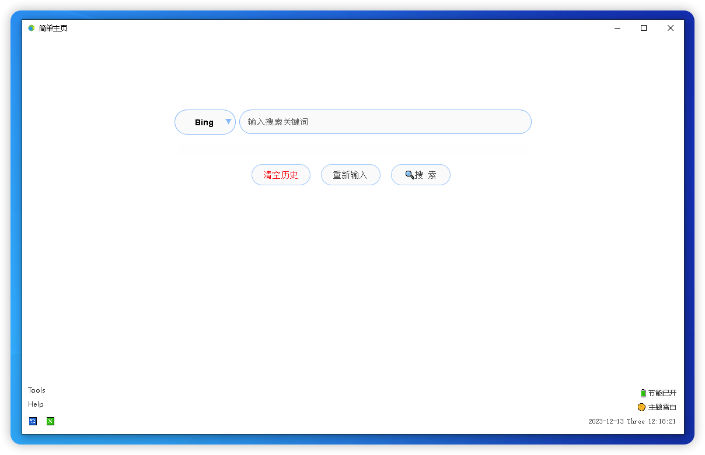

## 简单主页（PureHome），View Web框架在Go Wails框架中的应用
> 简单主页（PureHome）是一款替代浏览器搜索主页的软件，方便切换各种搜索引擎，保护搜索隐私、节省电能电能。

>将 Web PWA 应用打包，运行于 macOS11+、Win10+ 等电脑系统平台，性能优于Chromium打包的应用，并且安全性高。

>项目已经删除了npm命令，自定义的web源码在dist文件夹下。

>外挂（调用）wailsjs请直接使用window.runtime.xxx来调用。

截图：

## 运行环境
#### Mac平台（需macOS11+）
#### Win平台（需Win7+，依赖webview2环境。win10+ 22H2以后系统自带。 ）
下载安装webview2： https://developer.microsoft.com/zh-cn/microsoft-edge/webview2/#download

## 下载软件安装包
https://github.com/fyonecon/view-on-wails/tree/main/资料、备份、已打包程序/已打包软件

含：
> Mac通用安装包
> 
> Win ADM64安装包
> 
> Win ARM64安装包

## 相关库
#### View On Wails：
https://github.com/fyonecon/view-on-wails
#### View：
https://github.com/fyonecon/view

## Wails文档
https://wails.io/zh-Hans/docs/gettingstarted/installation

## 测试
`wails dev`

## 构建应用
To build a redistributable, production mode package, use `wails build`。

命令行文档：https://wails.io/zh-Hans/docs/reference/cli#%E6%9E%84%E5%BB%BA
### 打包成win AMD64
`wails build -platform windows/amd64`
### 打包成win ARM64
`wails build -platform windows/arm64`
### 打包成mac universal（同时支持x86和ARM）
`wails build -platform darwin/universal`
### 打包成mac AMD64
`wails build -platform darwin/amd64`
### 打包成mac ARM64
`wails build -platform darwin/arm64`

## 构建应用安装包（NSIS 安装程序）
文档：https://wails.io/zh-Hans/docs/guides/windows-installer

### 打包成win AMD64安装程序（可用）
`wails build -platform windows/amd64 -nsis`
### 打包成win ARM64安装程序（可用）
`wails build -platform windows/arm64 -nsis`
### 打包成mac 通用安装程序（同时支持x86和ARM）（需要手动生成.dmg安装包）
`wails build -platform darwin/universal nsis`
### 打包成mac AMD64安装程序（需要手动生成.dmg安装包）
`wails build -platform darwin/amd64 nsis`
### 打包成mac ARM64安装程序（需要手动生成.dmg安装包）
`wails build -platform darwin/arm64 nsis`

## Apache2.0 （Start 2023-11-28）